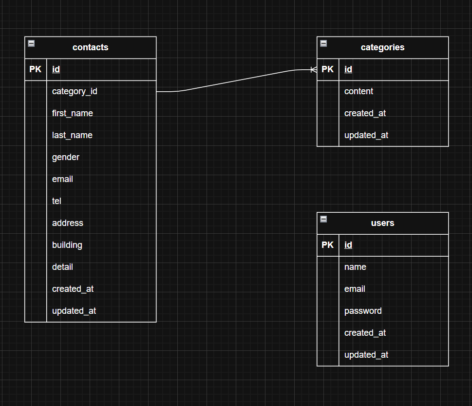

# アプリケーション名

FashionablyLate（お問い合わせフォーム & 管理画面）

------------------------------------------------------------------------

## 環境構築

本アプリケーションは Docker を使用した開発環境を前提としています。

### 1. リポジトリをクローン

    git clone git@github.com:Hiroyuki-Kai/confirmation-test.git
    cd confirmation-test

### 2. Docker起動

    docker-compose up -d --build

### 3. Composerインストール

    docker-compose exec php up -d --build
    composer install

### 4. .env作成

    docker-compose exec php cp .env.example .env

**作成した.env の DB 設定の以下の項目を修正** 
**※ .env はホスト側（VSCodeなど）で編集してください**

- DB_HOST=mysql
- DB_DATABASE=laravel_db
- DB_USERNAME=laravel_user
- DB_PASSWORD=laravel_pass

### 5. アプリケーションキー生成

    docker-compose exec php php artisan key:generate

### 6. マイグレーション

    docker-compose exec php php artisan migrate

### 7．シーディング
    docker-compose exec php php artisan db:seed

------------------------------------------------------------------------

## 使用技術（実行環境）

-   PHP 8.4.10
-   Laravel 8.83.29
-   MySQL 8.0.26
-   Docker
-   HTML / CSS

------------------------------------------------------------------------

## ER図

以下は本アプリケーションのER図です。

------------------------------------------------------------------------

## 主な機能一覧

### ■ お問い合わせ機能

-   入力フォーム
-   確認画面
-   完了画面
-   バリデーション（FormRequest使用）
-   データベース保存

### ■ 管理画面

-   お問い合わせ一覧表示
-   ページネーション（8件ずつ表示）
-   検索機能（名前・性別・メール・日付など）
-   詳細表示（モーダル風UI）
-   削除機能
-   エクスポート機能

### ■ 認証機能

-   会員登録
-   ログイン / ログアウト
-   Fortifyを利用した認証機能

------------------------------------------------------------------------

## URL一覧（ローカル環境）

-   お問い合わせフォーム    http://localhost/
-   確認画面               http://localhost/contact/confirm
-   完了画面               http://localhost/contact/thanks
-   管理画面               http://localhost/admin
-   会員登録               http://localhost/register
-   ログイン               http://localhost/login

※一部画面については、ページとして作成できていません。申し訳ございません。
------------------------------------------------------------------------
